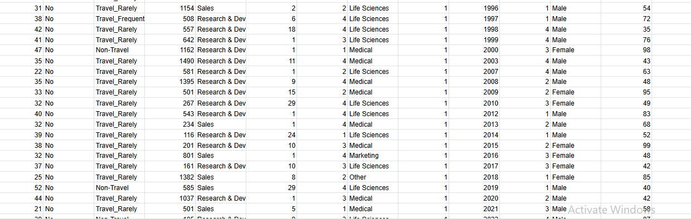
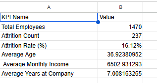

# 📊 HR Analytics Dashboard (Excel)

An interactive HR analytics dashboard built using Microsoft Excel to analyze employee attrition trends and key workforce metrics.

---

## 🎯 Objective

To analyze employee attrition and identify patterns based on department, job role, age group, and other factors using Excel-based analytics.

---

## 🛠️ Tools Used

- Microsoft Excel
- Pivot Tables
- Pivot Charts
- KPI Cards
- Data Cleaning

---

## 📌 Key Metrics

- Total Employees
- Attrition Count
- Attrition Rate (%)
- Average Age
- Average Monthly Income
- Average Years at Company

---

## 📊 Dashboard Insights

- Attrition by Department
- Attrition by Job Role
- Age Group Attrition Analysis
- Gender Attrition Comparison
- Overtime vs Attrition Trends

---

## 📸 Screenshots

### Raw Data

### KPI Calculations

### Pivot Analysis

### Final Dashboard

---

## 📁 Files Included

- HR_Attrition_Dashboard.xlsx → Interactive Excel dashboard
- Dataset used for analysis (optional)

---

## 👩‍💻 Author

**Anushya**  
Data Analyst | Excel | Power BI | Python
# hr-analytics-excel-dashboard
HR attrition analysis dashboard built using Microsoft Excel
